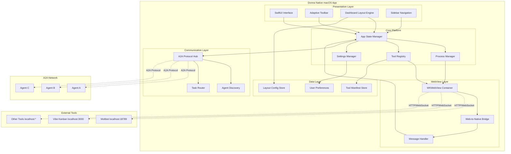
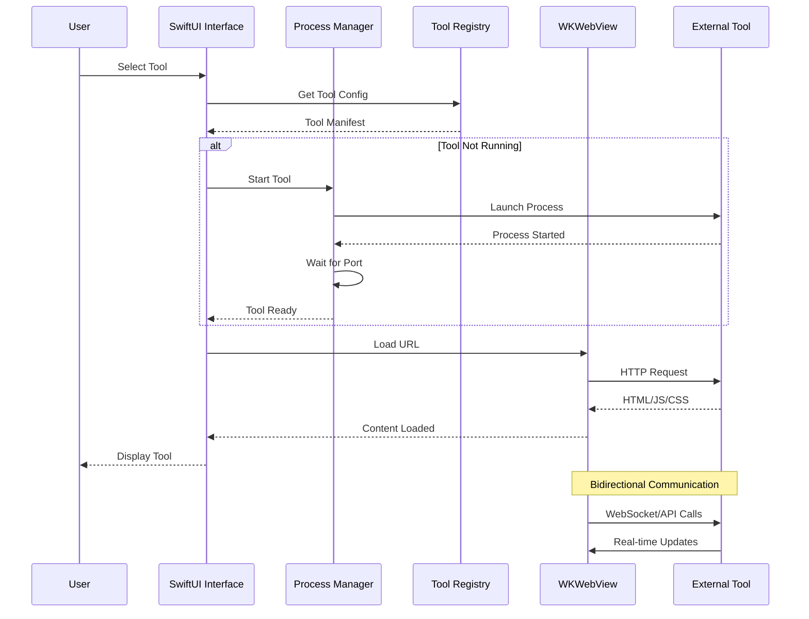
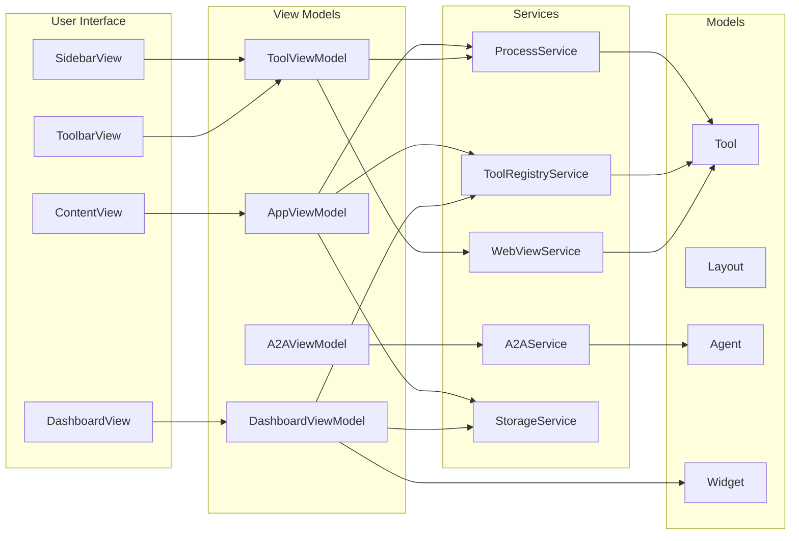

# Donna - Technical Architecture Document

> **Version**: 1.0  
> **Last Updated**: 2026-01-28  
> **Author**: Winston (BMAD Architect Agent)

This document serves as the comprehensive technical blueprint for building Donna - a native macOS application that hosts browser-based open-source tools in a unified, adaptive interface.

---

## Table of Contents

1. [System Architecture Overview](#1-system-architecture-overview)
2. [Module Breakdown](#2-module-breakdown)
3. [Technology Stack](#3-technology-stack)
4. [Data Models](#4-data-models)
5. [API Specifications](#5-api-specifications)
6. [File Structure](#6-file-structure)
7. [Implementation Guidelines](#7-implementation-guidelines)

---

## 1. System Architecture Overview

### 1.1 High-Level Architecture Diagram



### 1.2 Data Flow Diagram



### 1.3 Component Interaction Diagram



---

## 2. Module Breakdown

### 2.1 Core Platform Module

**Purpose**: Foundation of the application - manages app lifecycle, state, and core services.

**Key Components**:

| Component | Responsibility | Swift Type |
|-----------|---------------|------------|
| App State Manager | Central state coordination | `AppState: ObservableObject` |
| Process Manager | Launch/monitor external tools | `ProcessManager: ObservableObject` |
| Settings Manager | User preferences & config | `SettingsManager: ObservableObject` |
| Error Handler | Global error management | `ErrorHandler` |

**Code Example**:

```swift
// MARK: - App State Manager
@MainActor
class AppState: ObservableObject {
    @Published var activeTool: Tool?
    @Published var isLoading = false
    @Published var error: AppError?
    
    static let shared = AppState()
    
    private init() {}
    
    func activateTool(_ tool: Tool) {
        Task {
            isLoading = true
            defer { isLoading = false }
            
            do {
                try await ProcessManager.shared.ensureRunning(tool)
                activeTool = tool
            } catch {
                self.error = error as? AppError ?? .unknown(error)
            }
        }
    }
}

// MARK: - Process Manager
@MainActor
class ProcessManager: ObservableObject {
    @Published var runningProcesses: [String: Process] = [:]
    @Published var processStatus: [String: ProcessStatus] = [:]
    
    static let shared = ProcessManager()
    
    func startTool(_ tool: Tool) async throws {
        guard runningProcesses[tool.id] == nil else { return }
        
        let process = Process()
        process.executableURL = tool.executableURL
        process.arguments = tool.startArguments
        
        // Setup output capture
        let outputPipe = Pipe()
        process.standardOutput = outputPipe
        process.standardError = outputPipe
        
        // Start process
        try process.run()
        runningProcesses[tool.id] = process
        processStatus[tool.id] = .starting
        
        // Wait for health check
        try await waitForHealthCheck(tool: tool)
        processStatus[tool.id] = .running
    }
    
    func stopTool(_ tool: Tool) {
        guard let process = runningProcesses[tool.id] else { return }
        process.terminate()
        runningProcesses.removeValue(forKey: tool.id)
        processStatus[tool.id] = .stopped
    }
    
    private func waitForHealthCheck(tool: Tool) async throws {
        // Poll health endpoint with timeout
        let startTime = Date()
        while Date().timeIntervalSince(startTime) < tool.startTimeout {
            if await isHealthy(tool) {
                return
            }
            try await Task.sleep(nanoseconds: 500_000_000) // 0.5s
        }
        throw AppError.toolStartupTimeout(tool.name)
    }
}

enum ProcessStatus: String {
    case stopped
    case starting
    case running
    case error
}
```

### 2.2 Adaptive UI Module

**Purpose**: Dynamic interface that adapts based on the active tool.

**Key Components**:

| Component | Responsibility | Swift Type |
|-----------|---------------|------------|
| Toolbar System | Tool-specific toolbar generation | `AdaptiveToolbar` |
| Toolbar Builder | Constructs toolbar from manifest | `ToolbarBuilder` |
| UI Chrome | Native window chrome management | `UIChromeManager` |

**Code Example**:

```swift
// MARK: - Toolbar System
struct AdaptiveToolbar: View {
    @ObservedObject var toolViewModel: ToolViewModel
    
    var body: some View {
        HStack(spacing: 16) {
            // Tool-specific items
            ForEach(toolViewModel.toolbarItems) { item in
                ToolbarItemView(item: item) {
                    toolViewModel.executeToolbarAction(item)
                }
            }
            
            Spacer()
            
            // Common actions
            ToolbarCommonActions()
        }
        .padding(.horizontal)
        .frame(height: 44)
        .background(Color(nsColor: .controlBackgroundColor))
    }
}

struct ToolbarItemView: View {
    let item: ToolbarItem
    let action: () -> Void
    
    var body: some View {
        switch item.type {
        case .button:
            Button(action: action) {
                Label(item.label, systemImage: item.icon ?? "")
            }
            .keyboardShortcut(item.shortcut)
            
        case .dropdown:
            Menu(item.label) {
                ForEach(item.options ?? [], id: \.self) { option in
                    Button(option) {
                        action()
                    }
                }
            }
            
        case .search:
            SearchField(placeholder: item.placeholder ?? "Search", text: .constant(""))
            
        case .separator:
            Divider()
            .frame(height: 20)
        }
    }
}

// MARK: - Toolbar Models
struct ToolbarItem: Identifiable {
    let id = UUID()
    let type: ToolbarItemType
    let label: String
    let icon: String?
    let action: String
    let shortcut: KeyboardShortcut?
    let options: [String]?
    let placeholder: String?
}

enum ToolbarItemType: String, Codable {
    case button
    case dropdown
    case toggle
    case search
    case separator
}

// MARK: - UI Chrome Manager
class UIChromeManager: ObservableObject {
    @Published var title: String = "Donna"
    @Published var subtitle: String? = nil
    @Published var windowStyle: WindowStyle = .default
    
    func applyToolConfiguration(_ config: ToolUIConfiguration) {
        title = config.title
        subtitle = config.subtitle
        windowStyle = config.windowStyle
    }
}

struct ToolUIConfiguration {
    let title: String
    let subtitle: String?
    let windowStyle: WindowStyle
    let toolbarItems: [ToolbarItem]
    let sidebarItems: [SidebarItem]?
}

enum WindowStyle {
    case `default`
    case compact
    case expanded
    case fullscreen
}
```

### 2.3 Tool Registry Module

**Purpose**: Manages tool discovery, installation, and lifecycle.

**Key Components**:

| Component | Responsibility | Swift Type |
|-----------|---------------|------------|
| Tool Registry | Central tool management | `ToolRegistry` |
| Manifest Parser | Parse tool manifests | `ManifestParser` |
| Discovery Service | Auto-discover local tools | `ToolDiscoveryService` |
| Installation Manager | Handle tool installation | `InstallationManager` |

**Code Example**:

```swift
// MARK: - Tool Registry
@MainActor
class ToolRegistry: ObservableObject {
    @Published var tools: [Tool] = []
    @Published var installedTools: [Tool] = []
    
    static let shared = ToolRegistry()
    
    private let manifestParser = ManifestParser()
    private let discoveryService = ToolDiscoveryService()
    
    func loadTools() async {
        // Load from bundled manifests
        let bundledTools = await loadBundledManifests()
        
        // Discover local tools
        let discoveredTools = await discoveryService.discover()
        
        // Merge and deduplicate
        tools = (bundledTools + discoveredTools).uniqued(by: \.id)
        
        // Filter installed
        installedTools = tools.filter { $0.isInstalled }
    }
    
    func registerTool(from manifestURL: URL) async throws -> Tool {
        let manifest = try await manifestParser.parse(url: manifestURL)
        let tool = Tool(from: manifest)
        tools.append(tool)
        return tool
    }
    
    func getTool(byId id: String) -> Tool? {
        tools.first { $0.id == id }
    }
}

// MARK: - Manifest Parser
class ManifestParser {
    func parse(url: URL) async throws -> ToolManifest {
        let data = try Data(contentsOf: url)
        let decoder = JSONDecoder()
        decoder.keyDecodingStrategy = .convertFromSnakeCase
        return try decoder.decode(ToolManifest.self, from: data)
    }
    
    func parse(yamlURL: URL) async throws -> ToolManifest {
        let content = try String(contentsOf: yamlURL)
        // Use Yams library for YAML parsing
        // return try YAMLDecoder().decode(ToolManifest.self, from: content)
        fatalError("YAML parsing requires Yams dependency")
    }
}

// MARK: - Tool Discovery Service
class ToolDiscoveryService {
    func discover() async -> [Tool] {
        var discovered: [Tool] = []
        
        // Check common ports
        let commonPorts = [18789, 3000, 8080, 5000, 8000]
        for port in commonPorts {
            if let tool = try? await checkPort(port) {
                discovered.append(tool)
            }
        }
        
        // mDNS/Bonjour discovery for A2A agents
        let agents = await discoverA2AAgents()
        discovered.append(contentsOf: agents)
        
        return discovered
    }
    
    private func checkPort(_ port: Int) async throws -> Tool? {
        let url = URL(string: "http://localhost:\(port)/.well-known/tool-manifest")!
        let (data, _) = try await URLSession.shared.data(from: url)
        let manifest = try JSONDecoder().decode(ToolManifest.self, from: data)
        return Tool(from: manifest, discoveredPort: port)
    }
    
    private func discoverA2AAgents() async -> [Tool] {
        // Implement mDNS discovery for A2A agents
        return []
    }
}
```

### 2.4 A2A Protocol Module

**Purpose**: Implements Google A2A protocol for agent-to-agent communication.

**Key Components**:

| Component | Responsibility | Swift Type |
|-----------|---------------|------------|
| A2A Hub | Central agent coordination | `A2AHub` |
| Agent Discovery | Find and register agents | `AgentDiscovery` |
| Task Router | Route tasks between agents | `TaskRouter` |
| Agent Card Manager | Manage agent metadata | `AgentCardManager` |

**Code Example**:

```swift
// MARK: - A2A Hub
@MainActor
class A2AHub: ObservableObject {
    @Published var agents: [A2AAgent] = []
    @Published var activeTasks: [A2ATask] = []
    @Published var conversations: [AgentConversation] = []
    
    static let shared = A2AHub()
    
    private let discovery = AgentDiscovery()
    private let router = TaskRouter()
    
    func initialize() async {
        // Start discovery
        await discovery.start { [weak self] agent in
            self?.registerAgent(agent)
        }
    }
    
    func registerAgent(_ agent: A2AAgent) {
        guard !agents.contains(where: { $0.id == agent.id }) else { return }
        agents.append(agent)
    }
    
    func sendTask(from sourceId: String, to targetId: String, payload: TaskPayload) async throws -> TaskResult {
        guard let targetAgent = agents.first(where: { $0.id == targetId }) else {
            throw A2AError.agentNotFound(targetId)
        }
        
        let task = A2ATask(
            id: UUID().uuidString,
            sourceId: sourceId,
            targetId: targetId,
            payload: payload,
            status: .pending
        )
        
        activeTasks.append(task)
        
        do {
            let result = try await router.send(task, to: targetAgent)
            updateTask(task.id, status: .completed)
            return result
        } catch {
            updateTask(task.id, status: .failed)
            throw error
        }
    }
    
    private func updateTask(_ id: String, status: TaskStatus) {
        if let index = activeTasks.firstIndex(where: { $0.id == id }) {
            activeTasks[index].status = status
        }
    }
}

// MARK: - Agent Card (A2A Spec)
struct AgentCard: Codable {
    let name: String
    let description: String
    let url: URL
    let provider: Provider?
    let version: String
    let documentationUrl: URL?
    let capabilities: Capabilities
    let authentication: Authentication
    let defaultInputModes: [String]
    let defaultOutputModes: [String]
    let skills: [Skill]
    
    struct Provider: Codable {
        let organization: String
        let url: URL?
    }
    
    struct Capabilities: Codable {
        let streaming: Bool
        let pushNotifications: Bool
        let stateTransitionHistory: Bool
    }
    
    struct Authentication: Codable {
        let schemes: [String]
        let credentials: String?
    }
    
    struct Skill: Codable {
        let id: String
        let name: String
        let description: String
        let tags: [String]
        let examples: [String]?
        let inputModes: [String]?
        let outputModes: [String]?
    }
}

// MARK: - A2A Agent Protocol
protocol A2AAgent: Identifiable {
    var id: String { get }
    var card: AgentCard { get }
    var status: AgentStatus { get }
    
    func sendTask(_ task: A2ATask) async throws -> TaskResult
    func receiveTask(_ task: A2ATask) async -> TaskResult
}

enum AgentStatus: String {
    case offline
    case online
    case busy
    case error
}

// MARK: - Task Models
struct A2ATask: Identifiable {
    let id: String
    let sourceId: String
    let targetId: String
    let payload: TaskPayload
    var status: TaskStatus
    var createdAt: Date = Date()
    var completedAt: Date?
}

enum TaskStatus: String {
    case pending
    case inProgress
    case completed
    case failed
    case cancelled
}

struct TaskPayload {
    let type: String
    let data: [String: Any]
    let priority: TaskPriority
}

enum TaskPriority: Int {
    case low = 0
    case normal = 1
    case high = 2
    case critical = 3
}

struct TaskResult {
    let success: Bool
    let data: [String: Any]?
    let error: String?
}

enum A2AError: Error {
    case agentNotFound(String)
    case taskTimeout
    case invalidPayload
    case authenticationFailed
    case networkError(Error)
}
```

### 2.5 Dashboard Module

**Purpose**: Customizable dashboard with widgets and flexible layouts.

**Key Components**:

| Component | Responsibility | Swift Type |
|-----------|---------------|------------|
| Layout Engine | Manage dashboard layouts | `LayoutEngine` |
| Widget System | Render and manage widgets | `WidgetManager` |
| Drag & Drop | Handle layout customization | `DragDropController` |
| Layout Persistence | Save/restore layouts | `LayoutStore` |

**Code Example**:

```swift
// MARK: - Dashboard View Model
@MainActor
class DashboardViewModel: ObservableObject {
    @Published var currentLayout: DashboardLayout
    @Published var widgets: [Widget] = []
    @Published var isEditing = false
    
    private let layoutEngine = LayoutEngine()
    private let widgetManager = WidgetManager()
    
    init() {
        currentLayout = LayoutStore.shared.loadDefaultLayout()
        loadWidgets()
    }
    
    func addWidget(_ widget: Widget, at position: WidgetPosition) {
        widgets.append(widget)
        layoutEngine.placeWidget(widget, at: position)
    }
    
    func removeWidget(_ widget: Widget) {
        widgets.removeAll { $0.id == widget.id }
        layoutEngine.removeWidget(widget)
    }
    
    func saveLayout() {
        LayoutStore.shared.save(currentLayout)
    }
    
    func switchLayout(to type: LayoutType) {
        currentLayout = layoutEngine.createLayout(type: type, widgets: widgets)
    }
    
    private func loadWidgets() {
        // Load widgets from active tools
        widgets = widgetManager.availableWidgets()
    }
}

// MARK: - Layout System
struct DashboardLayout: Codable {
    var id: UUID
    var name: String
    var type: LayoutType
    var widgetPositions: [WidgetPosition]
    var createdAt: Date
    var updatedAt: Date
}

enum LayoutType: String, Codable {
    case single        // One tool fullscreen
    case splitVertical // Two tools side by side
    case splitHorizontal // Two tools stacked
    case grid          // Multiple tools in grid
    case tabs          // Tabbed interface
    case floating      // Floating windows
    case custom        // User-defined
}

struct WidgetPosition: Codable {
    let widgetId: String
    var x: Double
    var y: Double
    var width: Double
    var height: Double
    var zIndex: Int
}

// MARK: - Widget Protocol
protocol Widget: Identifiable {
    var id: String { get }
    var title: String { get }
    var size: WidgetSize { get }
    var refreshInterval: TimeInterval? { get }
    var source: WidgetSource { get }
    
    func render() -> AnyView
    func refresh() async
}

enum WidgetSize: String, Codable {
    case small   // 1x1 grid
    case medium  // 2x1 grid
    case large   // 2x2 grid
    case full    // Full width
}

enum WidgetSource {
    case tool(toolId: String, endpoint: String)
    case agent(agentId: String)
    case system(SystemWidgetType)
    case custom
}

enum SystemWidgetType: String {
    case clock
    case calendar
    case systemStatus
    case notifications
}

// MARK: - Layout Engine
class LayoutEngine {
    func createLayout(type: LayoutType, widgets: [Widget]) -> DashboardLayout {
        let positions: [WidgetPosition] = widgets.enumerated().map { index, widget in
            calculatePosition(for: widget, at: index, in: type, totalCount: widgets.count)
        }
        
        return DashboardLayout(
            id: UUID(),
            name: type.rawValue.capitalized,
            type: type,
            widgetPositions: positions,
            createdAt: Date(),
            updatedAt: Date()
        )
    }
    
    func placeWidget(_ widget: Widget, at position: WidgetPosition) {
        // Update layout with new widget position
    }
    
    func removeWidget(_ widget: Widget) {
        // Remove widget from layout
    }
    
    private func calculatePosition(for widget: Widget, at index: Int, in layoutType: LayoutType, totalCount: Int) -> WidgetPosition {
        switch layoutType {
        case .grid:
            let columns = 3
            let row = index / columns
            let col = index % columns
            return WidgetPosition(
                widgetId: widget.id,
                x: Double(col) * 0.33,
                y: Double(row) * 0.33,
                width: 0.33,
                height: 0.33,
                zIndex: index
            )
            
        case .splitVertical:
            let width = 1.0 / Double(totalCount)
            return WidgetPosition(
                widgetId: widget.id,
                x: Double(index) * width,
                y: 0,
                width: width,
                height: 1.0,
                zIndex: index
            )
            
        default:
            return WidgetPosition(
                widgetId: widget.id,
                x: 0,
                y: 0,
                width: 1.0,
                height: 1.0,
                zIndex: index
            )
        }
    }
}

// MARK: - Widget Manager
class WidgetManager {
    func availableWidgets() -> [Widget] {
        // Collect widgets from all sources
        var widgets: [Widget] = []
        
        // System widgets
        widgets.append(SystemClockWidget())
        widgets.append(SystemStatusWidget())
        
        // Tool widgets
        for tool in ToolRegistry.shared.installedTools {
            widgets.append(contentsOf: tool.widgets)
        }
        
        return widgets
    }
}

// MARK: - Example Widgets
struct SystemClockWidget: Widget {
    let id = "system.clock"
    let title = "Clock"
    let size = WidgetSize.small
    let refreshInterval: TimeInterval? = 1.0
    let source = WidgetSource.system(.clock)
    
    @State private var currentTime = Date()
    
    func render() -> AnyView {
        AnyView(
            VStack {
                Text(currentTime, style: .time)
                    .font(.largeTitle)
                Text(currentTime, style: .date)
                    .font(.caption)
            }
            .onAppear {
                Timer.scheduledTimer(withTimeInterval: 1.0, repeats: true) { _ in
                    currentTime = Date()
                }
            }
        )
    }
    
    func refresh() async {
        // Clock updates via timer
    }
}
```

---

## 3. Technology Stack

### 3.1 Core Technologies

| Layer | Technology | Purpose |
|-------|------------|---------|
| **Language** | Swift 5.9+ | Primary development language |
| **UI Framework** | SwiftUI | Modern declarative UI |
| **Legacy UI** | AppKit | Native macOS integration |
| **Web Content** | WKWebView | Embed browser-based tools |
| **Process Control** | Foundation.Process | Manage external tool processes |
| **Networking** | URLSession | HTTP/WebSocket communication |
| **Persistence** | Core Data / SwiftData | Local data storage |
| **Serialization** | Codable | JSON/YAML parsing |

### 3.2 SwiftUI Patterns

**State Management**:

```swift
// Use @State for view-local state
struct ToolView: View {
    @State private var isLoading = false
    @State private var searchText = ""
}

// Use @StateObject for reference-type view models
struct ContentView: View {
    @StateObject private var viewModel = AppViewModel()
}

// Use @ObservedObject for injected view models
struct ToolbarView: View {
    @ObservedObject var viewModel: ToolViewModel
}

// Use @Environment for shared dependencies
struct SettingsView: View {
    @Environment(\.settingsManager) private var settings
}

// Use @AppStorage for user preferences
struct PreferencesView: View {
    @AppStorage("showSidebar") private var showSidebar = true
}
```

**MVVM Pattern**:

```swift
// Model
struct Tool: Identifiable, Codable {
    let id: String
    let name: String
    let description: String
}

// ViewModel
@MainActor
class ToolViewModel: ObservableObject {
    @Published var tools: [Tool] = []
    @Published var selectedTool: Tool?
    
    private let registry = ToolRegistry.shared
    
    func loadTools() async {
        tools = await registry.loadTools()
    }
    
    func selectTool(_ tool: Tool) {
        selectedTool = tool
    }
}

// View
struct ToolListView: View {
    @StateObject private var viewModel = ToolViewModel()
    
    var body: some View {
        List(viewModel.tools) { tool in
            ToolRow(tool: tool)
                .onTapGesture {
                    viewModel.selectTool(tool)
                }
        }
        .task {
            await viewModel.loadTools()
        }
    }
}
```

### 3.3 WKWebView Integration

```swift
import SwiftUI
import WebKit

// MARK: - WebView Representable
struct ToolWebView: NSViewRepresentable {
    let url: URL
    let messageHandler: WebMessageHandler
    
    func makeNSView(context: Context) -> WKWebView {
        let configuration = WKWebViewConfiguration()
        
        // Add message handler for web-to-native communication
        configuration.userContentController.add(
            context.coordinator,
            name: "donnaBridge"
        )
        
        // Enable developer tools
        configuration.preferences.setValue(true, forKey: "developerExtrasEnabled")
        
        let webView = WKWebView(frame: .zero, configuration: configuration)
        webView.navigationDelegate = context.coordinator
        webView.uiDelegate = context.coordinator
        
        // Load URL
        let request = URLRequest(url: url)
        webView.load(request)
        
        return webView
    }
    
    func updateNSView(_ nsView: WKWebView, context: Context) {
        // Update view if needed
    }
    
    func makeCoordinator() -> Coordinator {
        Coordinator(messageHandler: messageHandler)
    }
    
    class Coordinator: NSObject, WKNavigationDelegate, WKUIDelegate, WKScriptMessageHandler {
        let messageHandler: WebMessageHandler
        
        init(messageHandler: WebMessageHandler) {
            self.messageHandler = messageHandler
        }
        
        func webView(_ webView: WKWebView, didFinish navigation: WKNavigation!) {
            // Inject bridge script
            let script = """
                window.donna = {
                    postMessage: function(message) {
                        window.webkit.messageHandlers.donnaBridge.postMessage(message);
                    },
                    onMessage: null
                };
            """
            webView.evaluateJavaScript(script, completionHandler: nil)
        }
        
        func userContentController(_ userContentController: WKUserContentController, didReceive message: WKScriptMessage) {
            guard let body = message.body as? [String: Any] else { return }
            messageHandler.handle(message: body)
        }
    }
}

// MARK: - Web Message Handler
protocol WebMessageHandler {
    func handle(message: [String: Any])
}

class ToolMessageHandler: WebMessageHandler {
    func handle(message: [String: Any]) {
        guard let action = message["action"] as? String else { return }
        
        switch action {
        case "toolbarAction":
            if let toolbarAction = message["data"] as? String {
                handleToolbarAction(toolbarAction)
            }
        case "updateTitle":
            if let title = message["data"] as? String {
                updateWindowTitle(title)
            }
        default:
            print("Unknown action: \(action)")
        }
    }
    
    private func handleToolbarAction(_ action: String) {
        // Handle toolbar action from web
    }
    
    private func updateWindowTitle(_ title: String) {
        // Update native window title
    }
}
```

### 3.4 Process Management Strategy

```swift
// MARK: - Process Manager with Monitoring
@MainActor
class ProcessManager: ObservableObject {
    @Published var processes: [String: ManagedProcess] = [:]
    
    struct ManagedProcess {
        let process: Process
        let tool: Tool
        let startTime: Date
        var status: ProcessStatus
        var lastOutput: String?
    }
    
    func startTool(_ tool: Tool) async throws {
        // Check if already running
        if let existing = processes[tool.id], existing.status == .running {
            return
        }
        
        // Create process
        let process = Process()
        process.executableURL = tool.executableURL
        process.arguments = tool.startArguments
        process.environment = tool.environmentVariables
        
        // Setup output capture
        let outputPipe = Pipe()
        process.standardOutput = outputPipe
        process.standardError = outputPipe
        
        // Capture output
        outputPipe.fileHandleForReading.readabilityHandler = { [weak self] handle in
            let data = handle.availableData
            if let output = String(data: data, encoding: .utf8) {
                Task { @MainActor in
                    self?.processes[tool.id]?.lastOutput = output
                }
            }
        }
        
        // Handle termination
        process.terminationHandler = { [weak self] process in
            Task { @MainActor in
                self?.processes[tool.id]?.status = process.terminationStatus == 0 ? .stopped : .error
            }
        }
        
        // Start process
        try process.run()
        
        // Store reference
        processes[tool.id] = ManagedProcess(
            process: process,
            tool: tool,
            startTime: Date(),
            status: .starting,
            lastOutput: nil
        )
        
        // Wait for health check
        try await waitForHealthCheck(tool: tool)
        processes[tool.id]?.status = .running
    }
    
    func stopTool(_ tool: Tool) {
        guard let managedProcess = processes[tool.id] else { return }
        
        // Try graceful termination first
        managedProcess.process.terminate()
        
        // Force kill after timeout
        DispatchQueue.main.asyncAfter(deadline: .now() + 5) { [weak self] in
            if self?.processes[tool.id]?.status == .running {
                managedProcess.process.kill()
            }
        }
        
        processes[tool.id]?.status = .stopping
    }
    
    func stopAll() {
        for (toolId, _) in processes {
            if let tool = processes[toolId]?.tool {
                stopTool(tool)
            }
        }
    }
    
    private func waitForHealthCheck(tool: Tool) async throws {
        let startTime = Date()
        let timeout = tool.startTimeout
        
        while Date().timeIntervalSince(startTime) < timeout {
            do {
                let (_, response) = try await URLSession.shared.data(from: tool.healthCheckURL)
                if let httpResponse = response as? HTTPURLResponse,
                   httpResponse.statusCode == 200 {
                    return
                }
            } catch {
                // Continue waiting
            }
            
            try await Task.sleep(nanoseconds: 500_000_000) // 0.5s
        }
        
        throw AppError.toolStartupTimeout(tool.name)
    }
}
```

---

## 4. Data Models

### 4.1 Tool Manifest Schema

```swift
// MARK: - Tool Manifest
struct ToolManifest: Codable {
    let id: String
    let name: String
    let description: String
    let version: String
    let type: ToolType
    let author: String?
    let icon: String?
    let categories: [String]?
    
    let install: InstallConfig?
    let start: StartConfig
    let ui: UIConfig
    let widgets: [WidgetConfig]?
    let a2a: A2AConfig?
    
    enum ToolType: String, Codable {
        case webUI = "web-ui"
        case apiOnly = "api-only"
        case a2aAgent = "a2a-agent"
    }
}

// MARK: - Install Configuration
struct InstallConfig: Codable {
    let command: String
    let check: String?
    let dependencies: [String]?
}

// MARK: - Start Configuration
struct StartConfig: Codable {
    let command: String
    let arguments: [String]?
    let port: Int?
    let healthCheck: HealthCheckConfig
    let environment: [String: String]?
    let timeout: Int?
    
    struct HealthCheckConfig: Codable {
        let url: String
        let interval: Int?
        let maxRetries: Int?
    }
}

// MARK: - UI Configuration
struct UIConfig: Codable {
    let url: String
    let fullscreen: Bool?
    let width: Int?
    let height: Int?
    let toolbar: [ToolbarItemConfig]?
    let sidebar: [SidebarItemConfig]?
    let theme: ThemeConfig?
    
    struct ToolbarItemConfig: Codable {
        let type: String
        let label: String
        let icon: String?
        let action: String
        let shortcut: String?
        let options: [String]?
        let placeholder: String?
    }
    
    struct SidebarItemConfig: Codable {
        let type: String
        let label: String
        let icon: String?
        let action: String
        let source: String?
    }
    
    struct ThemeConfig: Codable {
        let primaryColor: String?
        let darkMode: Bool?
    }
}

// MARK: - Widget Configuration
struct WidgetConfig: Codable {
    let id: String
    let type: String
    let title: String
    let size: WidgetSize
    let source: WidgetSourceConfig
    let refreshInterval: Int?
    let settings: [String: String]?
    
    struct WidgetSourceConfig: Codable {
        let type: String
        let endpoint: String?
        let method: String?
        let params: [String: String]?
    }
}

// MARK: - A2A Configuration
struct A2AConfig: Codable {
    let supported: Bool
    let agentCard: String?
    let capabilities: [String]?
    let authentication: A2AAuthConfig?
    
    struct A2AAuthConfig: Codable {
        let type: String
        let endpoint: String?
    }
}
```

### 4.2 Layout Configuration Schema

```swift
// MARK: - Layout Configuration
struct LayoutConfiguration: Codable {
    let version: String
    let layouts: [SavedLayout]
    let activeLayoutId: String?
}

struct SavedLayout: Codable {
    let id: String
    let name: String
    let type: LayoutType
    let items: [LayoutItem]
    let settings: LayoutSettings?
    let createdAt: Date
    let updatedAt: Date
}

struct LayoutItem: Codable {
    let id: String
    let type: LayoutItemType
    let toolId: String?
    let widgetId: String?
    let position: Position
    let size: Size
    let metadata: [String: String]?
}

enum LayoutItemType: String, Codable {
    case tool
    case widget
    case group
}

struct Position: Codable {
    let x: Double
    let y: Double
    let zIndex: Int
}

struct Size: Codable {
    let width: Double
    let height: Double
    let minWidth: Double?
    let minHeight: Double?
    let maxWidth: Double?
    let maxHeight: Double?
}

struct LayoutSettings: Codable {
    let spacing: Double?
    let padding: Double?
    let backgroundColor: String?
    let showGrid: Bool?
    let snapToGrid: Bool?
    let gridSize: Double?
}
```

### 4.3 Widget Schema

```swift
// MARK: - Widget Data Model
struct WidgetModel: Identifiable, Codable {
    let id: String
    let type: WidgetType
    let title: String
    let description: String?
    let size: WidgetSize
    let refreshInterval: TimeInterval?
    let source: WidgetDataSource
    let configuration: WidgetConfiguration
    let actions: [WidgetAction]?
}

enum WidgetType: String, Codable {
    case status
    case counter
    case chart
    case list
    case table
    case text
    case html
    case image
    case progress
    case gauge
}

enum WidgetDataSource: Codable {
    case tool(toolId: String, endpoint: String)
    case agent(agentId: String)
    case system(SystemDataSource)
    case staticValue(StaticWidgetData)
    
    enum CodingKeys: String, CodingKey {
        case type, toolId, endpoint, agentId, system, value
    }
    
    func encode(to encoder: Encoder) throws {
        var container = encoder.container(keyedBy: CodingKeys.self)
        switch self {
        case .tool(let toolId, let endpoint):
            try container.encode("tool", forKey: .type)
            try container.encode(toolId, forKey: .toolId)
            try container.encode(endpoint, forKey: .endpoint)
        case .agent(let agentId):
            try container.encode("agent", forKey: .type)
            try container.encode(agentId, forKey: .agentId)
        case .system(let source):
            try container.encode("system", forKey: .type)
            try container.encode(source, forKey: .system)
        case .staticValue(let value):
            try container.encode("static", forKey: .type)
            try container.encode(value, forKey: .value)
        }
    }
}

enum SystemDataSource: String, Codable {
    case time
    case date
    case cpuUsage
    case memoryUsage
    case diskSpace
    case networkStatus
}

struct StaticWidgetData: Codable {
    let text: String?
    let number: Double?
    let imageUrl: String?
    let html: String?
}

struct WidgetConfiguration: Codable {
    let theme: WidgetTheme?
    let display: DisplayConfig?
    let thresholds: [ThresholdConfig]?
}

struct WidgetTheme: Codable {
    let backgroundColor: String?
    let textColor: String?
    let accentColor: String?
    let borderRadius: Double?
    let shadow: Bool?
}

struct DisplayConfig: Codable {
    let format: String?
    let unit: String?
    let precision: Int?
    let showLabels: Bool?
    let showLegend: Bool?
}

struct ThresholdConfig: Codable {
    let value: Double
    let color: String
    let label: String?
}

struct WidgetAction: Codable {
    let id: String
    let label: String
    let icon: String?
    let type: ActionType
    let target: String?
    let payload: [String: String]?
    
    enum ActionType: String, Codable {
        case navigate
        case refresh
        case openTool
        case sendMessage
        case custom
    }
}
```

### 4.4 Agent Card Schema (A2A)

```swift
// MARK: - A2A Agent Card (Full Implementation)
struct A2AAgentCard: Codable {
    let name: String
    let description: String
    let url: URL
    let provider: AgentProvider?
    let version: String
    let documentationUrl: URL?
    let capabilities: AgentCapabilities
    let authentication: AgentAuthentication
    let defaultInputModes: [String]
    let defaultOutputModes: [String]
    let skills: [AgentSkill]
    
    struct AgentProvider: Codable {
        let organization: String
        let url: URL?
    }
    
    struct AgentCapabilities: Codable {
        let streaming: Bool
        let pushNotifications: Bool
        let stateTransitionHistory: Bool
    }
    
    struct AgentAuthentication: Codable {
        let schemes: [String]
        let credentials: String?
    }
    
    struct AgentSkill: Codable {
        let id: String
        let name: String
        let description: String
        let tags: [String]
        let examples: [String]?
        let inputModes: [String]?
        let outputModes: [String]?
    }
}

// MARK: - A2A Task Request/Response
struct A2ATaskRequest: Codable {
    let id: String
    let sessionId: String?
    let acceptedOutputModes: [String]?
    let skillId: String?
    let input: TaskInput
    let pushNotification: PushNotificationConfig?
    let metadata: [String: String]?
    
    struct TaskInput: Codable {
        let type: String // text, file, data
        let data: String?
        let fileUrl: URL?
        let mimeType: String?
    }
    
    struct PushNotificationConfig: Codable {
        let url: URL
        let token: String?
        let authentication: AgentAuthentication?
    }
}

struct A2ATaskResponse: Codable {
    let id: String
    let sessionId: String?
    let status: TaskStatus
    let finalOutput: TaskOutput?
    let artifacts: [TaskArtifact]?
    let history: [TaskHistoryEntry]?
    let metadata: [String: String]?
    
    struct TaskOutput: Codable {
        let type: String
        let data: String?
        let fileUrl: URL?
        let mimeType: String?
    }
    
    struct TaskArtifact: Codable {
        let name: String
        let description: String?
        let parts: [ArtifactPart]
    }
    
    struct ArtifactPart: Codable {
        let type: String
        let data: String?
        let fileUrl: URL?
        let mimeType: String?
    }
    
    struct TaskHistoryEntry: Codable {
        let role: String // user, agent
        let parts: [ArtifactPart]
        let timestamp: Date
    }
}
```

---

## 5. API Specifications

### 5.1 Internal Module APIs

#### Core Platform API

```swift
// MARK: - AppState API
protocol AppStateProtocol {
    var activeTool: Tool? { get }
    var isLoading: Bool { get }
    var error: AppError? { get }
    
    func activateTool(_ tool: Tool) async
    func deactivateCurrentTool()
    func clearError()
}

// MARK: - ProcessManager API
protocol ProcessManagerProtocol {
    var runningProcesses: [String: Process] { get }
    var processStatus: [String: ProcessStatus] { get }
    
    func startTool(_ tool: Tool) async throws
    func stopTool(_ tool: Tool)
    func stopAll()
    func isRunning(_ tool: Tool) -> Bool
    func getStatus(_ tool: Tool) -> ProcessStatus
}

// MARK: - SettingsManager API
protocol SettingsManagerProtocol {
    var preferences: UserPreferences { get set }
    
    func load()
    func save()
    func resetToDefaults()
    func value<T>(for key: String) -> T?
    func setValue<T>(_ value: T, for key: String)
}
```

#### Tool Registry API

```swift
// MARK: - ToolRegistry API
protocol ToolRegistryProtocol {
    var tools: [Tool] { get }
    var installedTools: [Tool] { get }
    
    func loadTools() async
    func registerTool(from manifestURL: URL) async throws -> Tool
    func unregisterTool(_ tool: Tool)
    func getTool(byId id: String) -> Tool?
    func getTool(byName name: String) -> Tool?
    func isInstalled(_ tool: Tool) -> Bool
    func install(_ tool: Tool) async throws
    func uninstall(_ tool: Tool) async throws
}
```

#### Dashboard API

```swift
// MARK: - LayoutEngine API
protocol LayoutEngineProtocol {
    func createLayout(type: LayoutType, widgets: [Widget]) -> DashboardLayout
    func placeWidget(_ widget: Widget, at position: WidgetPosition)
    func removeWidget(_ widget: Widget)
    func moveWidget(_ widget: Widget, to position: WidgetPosition)
    func resizeWidget(_ widget: Widget, to size: Size)
    func saveLayout(_ layout: DashboardLayout)
    func loadLayout(id: String) -> DashboardLayout?
}

// MARK: - WidgetManager API
protocol WidgetManagerProtocol {
    var availableWidgets: [Widget] { get }
    
    func registerWidget(_ widget: Widget)
    func unregisterWidget(_ widget: Widget)
    func getWidget(byId id: String) -> Widget?
    func refreshWidget(_ widget: Widget) async
    func refreshAllWidgets() async
}
```

### 5.2 External Tool Communication API

```swift
// MARK: - Tool Communication Protocol
protocol ToolCommunicationProtocol {
    func sendCommand(_ command: ToolCommand) async throws -> ToolResponse
    func subscribeToEvents(from tool: Tool) -> AsyncStream<ToolEvent>
    func healthCheck(tool: Tool) async -> HealthStatus
}

struct ToolCommand: Codable {
    let action: String
    let parameters: [String: AnyCodable]
    let requestId: String
    let timestamp: Date
}

struct ToolResponse: Codable {
    let requestId: String
    let success: Bool
    let data: AnyCodable?
    let error: String?
    let timestamp: Date
}

enum ToolEvent: Codable {
    case statusChanged(StatusEvent)
    case dataUpdate(DataEvent)
    case notification(NotificationEvent)
    case error(ErrorEvent)
}

struct StatusEvent: Codable {
    let toolId: String
    let status: String
    let timestamp: Date
}

struct DataEvent: Codable {
    let toolId: String
    let endpoint: String
    let data: AnyCodable
}

struct NotificationEvent: Codable {
    let toolId: String
    let title: String
    let message: String
    let level: NotificationLevel
}

enum NotificationLevel: String, Codable {
    case info
    case warning
    case error
    case success
}

struct ErrorEvent: Codable {
    let toolId: String
    let error: String
    let code: String?
    let recoverable: Bool
}

struct HealthStatus: Codable {
    let healthy: Bool
    let latency: TimeInterval
    let version: String?
    let uptime: TimeInterval?
}
```

### 5.3 A2A Protocol Implementation

```swift
// MARK: - A2A Protocol Endpoints
enum A2AEndpoint {
    case agentCard
    case sendTask
    case getTaskStatus(taskId: String)
    case cancelTask(taskId: String)
    case subscribeToUpdates
    
    var path: String {
        switch self {
        case .agentCard:
            return "/.well-known/agent.json"
        case .sendTask:
            return "/a2a/tasks"
        case .getTaskStatus(let taskId):
            return "/a2a/tasks/\(taskId)"
        case .cancelTask(let taskId):
            return "/a2a/tasks/\(taskId)/cancel"
        case .subscribeToUpdates:
            return "/a2a/tasks/subscribe"
        }
    }
}

// MARK: - A2A Client
class A2AClient {
    private let baseURL: URL
    private let session: URLSession
    
    init(baseURL: URL) {
        self.baseURL = baseURL
        self.session = URLSession.shared
    }
    
    func fetchAgentCard() async throws -> A2AAgentCard {
        let url = baseURL.appendingPathComponent(A2AEndpoint.agentCard.path)
        let (data, _) = try await session.data(from: url)
        return try JSONDecoder().decode(A2AAgentCard.self, from: data)
    }
    
    func sendTask(_ request: A2ATaskRequest) async throws -> A2ATaskResponse {
        let url = baseURL.appendingPathComponent(A2AEndpoint.sendTask.path)
        var urlRequest = URLRequest(url: url)
        urlRequest.httpMethod = "POST"
        urlRequest.setValue("application/json", forHTTPHeaderField: "Content-Type")
        urlRequest.httpBody = try JSONEncoder().encode(request)
        
        let (data, _) = try await session.data(for: urlRequest)
        return try JSONDecoder().decode(A2ATaskResponse.self, from: data)
    }
    
    func getTaskStatus(taskId: String) async throws -> A2ATaskResponse {
        let url = baseURL.appendingPathComponent(A2AEndpoint.getTaskStatus(taskId: taskId).path)
        let (data, _) = try await session.data(from: url)
        return try JSONDecoder().decode(A2ATaskResponse.self, from: data)
    }
    
    func cancelTask(taskId: String) async throws {
        let url = baseURL.appendingPathComponent(A2AEndpoint.cancelTask(taskId: taskId).path)
        var request = URLRequest(url: url)
        request.httpMethod = "POST"
        _ = try await session.data(for: request)
    }
    
    func subscribeToUpdates(taskId: String) async throws -> AsyncStream<A2ATaskResponse> {
        // Implement WebSocket or SSE subscription
        fatalError("Subscription not yet implemented")
    }
}

// MARK: - A2A Server (for Donna itself as an agent)
class A2AServer: ObservableObject {
    @Published var activeTasks: [String: A2ATaskRequest] = [:]
    
    private var cancellables = Set<AnyCancellable>()
    
    func start(port: Int) {
        // Implement HTTP server to handle A2A requests
        // Could use Vapor, Hummingbird, or NIOHTTP1
    }
    
    func handleTaskRequest(_ request: A2ATaskRequest) -> A2ATaskResponse {
        activeTasks[request.id] = request
        
        // Route to appropriate handler based on skill
        if let skillId = request.skillId {
            return handleSkillTask(skillId: skillId, request: request)
        }
        
        // Default task handling
        return A2ATaskResponse(
            id: request.id,
            sessionId: request.sessionId,
            status: .completed,
            finalOutput: nil,
            artifacts: nil,
            history: nil,
            metadata: nil
        )
    }
    
    private func handleSkillTask(skillId: String, request: A2ATaskRequest) -> A2ATaskResponse {
        // Implement skill-specific handling
        fatalError("Skill handling not implemented")
    }
}
```

---

## 6. File Structure

### 6.1 Recommended Xcode Project Structure

```
Donna/
├── Donna.xcodeproj/
├── Donna/
│   ├── App/
│   │   ├── DonnaApp.swift              # App entry point
│   │   ├── AppDelegate.swift           # App lifecycle
│   │   └── Info.plist
│   │
│   ├── Core/
│   │   ├── State/
│   │   │   ├── AppState.swift          # Global app state
│   │   │   ├── ProcessState.swift      # Process management state
│   │   │   └── SettingsState.swift     # User preferences state
│   │   │
│   │   ├── Managers/
│   │   │   ├── ProcessManager.swift    # External tool process control
│   │   │   ├── SettingsManager.swift   # User preferences
│   │   │   └── ErrorManager.swift      # Error handling
│   │   │
│   │   ├── Services/
│   │   │   ├── StorageService.swift    # Persistence layer
│   │   │   ├── NetworkService.swift    # HTTP/WebSocket
│   │   │   └── LoggingService.swift    # Logging infrastructure
│   │   │
│   │   └── Utilities/
│   │       ├── Extensions/
│   │       │   ├── String+Extensions.swift
│   │       │   ├── URL+Extensions.swift
│   │       │   └── View+Extensions.swift
│   │       ├── Constants.swift
│   │       └── Helpers.swift
│   │
│   ├── Features/
│   │   ├── Sidebar/
│   │   │   ├── Views/
│   │   │   │   ├── SidebarView.swift
│   │   │   │   ├── ToolRowView.swift
│   │   │   │   └── ToolGroupView.swift
│   │   │   ├── ViewModels/
│   │   │   │   └── SidebarViewModel.swift
│   │   │   └── Models/
│   │   │       └── ToolGroup.swift
│   │   │
│   │   ├── Toolbar/
│   │   │   ├── Views/
│   │   │   │   ├── AdaptiveToolbar.swift
│   │   │   │   ├── ToolbarItemView.swift
│   │   │   │   └── ToolbarButton.swift
│   │   │   ├── ViewModels/
│   │   │   │   └── ToolbarViewModel.swift
│   │   │   └── Models/
│   │   │       ├── ToolbarItem.swift
│   │   │       └── ToolbarAction.swift
│   │   │
│   │   ├── WebView/
│   │   │   ├── Views/
│   │   │   │   ├── ToolWebView.swift
│   │   │   │   └── WebViewContainer.swift
│   │   │   ├── ViewModels/
│   │   │   │   └── WebViewModel.swift
│   │   │   ├── Coordinators/
│   │   │   │   └── WebViewCoordinator.swift
│   │   │   └── Bridge/
│   │   │       ├── WebMessageHandler.swift
│   │   │       └── JavaScriptBridge.swift
│   │   │
│   │   ├── Dashboard/
│   │   │   ├── Views/
│   │   │   │   ├── DashboardView.swift
│   │   │   │   ├── LayoutView.swift
│   │   │   │   └── WidgetContainerView.swift
│   │   │   ├── ViewModels/
│   │   │   │   └── DashboardViewModel.swift
│   │   │   ├── LayoutEngine/
│   │   │   │   ├── LayoutEngine.swift
│   │   │   │   ├── GridLayout.swift
│   │   │   │   ├── SplitLayout.swift
│   │   │   │   └── FloatingLayout.swift
│   │   │   └── Widgets/
│   │   │       ├── WidgetProtocol.swift
│   │   │       ├── WidgetManager.swift
│   │   │       └── BuiltIn/
│   │   │           ├── ClockWidget.swift
│   │   │           └── StatusWidget.swift
│   │   │
│   │   ├── ToolRegistry/
│   │   │   ├── Views/
│   │   │   │   ├── ToolRegistryView.swift
│   │   │   │   ├── ToolDetailView.swift
│   │   │   │   └── InstallToolView.swift
│   │   │   ├── ViewModels/
│   │   │   │   └── ToolRegistryViewModel.swift
│   │   │   ├── Services/
│   │   │   │   ├── ToolRegistry.swift
│   │   │   │   ├── ManifestParser.swift
│   │   │   │   ├── ToolDiscoveryService.swift
│   │   │   │   └── InstallationManager.swift
│   │   │   └── Models/
│   │   │       ├── Tool.swift
│   │   │       ├── ToolManifest.swift
│   │   │       └── ToolStatus.swift
│   │   │
│   │   ├── A2A/
│   │   │   ├── Views/
│   │   │   │   ├── AgentNetworkView.swift
│   │   │   │   ├── AgentCardView.swift
│   │   │   │   └── TaskMonitorView.swift
│   │   │   ├── ViewModels/
│   │   │   │   └── A2AViewModel.swift
│   │   │   ├── Services/
│   │   │   │   ├── A2AHub.swift
│   │   │   │   ├── A2AClient.swift
│   │   │   │   ├── AgentDiscovery.swift
│   │   │   │   └── TaskRouter.swift
│   │   │   └── Models/
│   │   │       ├── AgentCard.swift
│   │   │       ├── A2ATask.swift
│   │   │       └── AgentConversation.swift
│   │   │
│   │   └── Settings/
│   │       ├── Views/
│   │       │   ├── SettingsView.swift
│   │       │   ├── GeneralSettingsView.swift
│   │       │   └── ToolSettingsView.swift
│   │       └── ViewModels/
│   │           └── SettingsViewModel.swift
│   │
│   ├── Models/
│   │   ├── Tool/
│   │   │   ├── Tool.swift
│   │   │   ├── ToolConfiguration.swift
│   │   │   └── ToolProcess.swift
│   │   │
│   │   ├── Layout/
│   │   │   ├── Layout.swift
│   │   │   ├── LayoutConfiguration.swift
│   │   │   └── WidgetPosition.swift
│   │   │
│   │   ├── Widget/
│   │   │   ├── Widget.swift
│   │   │   ├── WidgetConfiguration.swift
│   │   │   └── WidgetData.swift
│   │   │
│   │   ├── A2A/
│   │   │   ├── Agent.swift
│   │   │   ├── AgentCard.swift
│   │   │   ├── Task.swift
│   │   │   └── Message.swift
│   │   │
│   │   └── Common/
│   │       ├── IdentifiableModels.swift
│   │       └── CodableTypes.swift
│   │
│   ├── Resources/
│   │   ├── Assets.xcassets/
│   │   │   └── ...
│   │   ├── Manifests/
│   │   │   ├── moltbot.json
│   │   │   └── vibe-kanban.json
│   │   ├── Preview Content/
│   │   │   └── PreviewAssets.xcassets/
│   │   └── Localizable.strings
│   │
│   └── Supporting Files/
│       ├── Donna.entitlements
│       └── main.swift
│
├── DonnaTests/
│   ├── Core/
│   │   ├── ProcessManagerTests.swift
│   │   └── SettingsManagerTests.swift
│   ├── Features/
│   │   ├── ToolRegistryTests.swift
│   │   ├── LayoutEngineTests.swift
│   │   └── A2AHubTests.swift
│   └── Mocks/
│       └── MockServices.swift
│
├── DonnaUITests/
│   └── ...
│
└── Packages/
    └── DonnaKit (optional local package)
```

### 6.2 Naming Conventions

#### Files

| Type | Convention | Example |
|------|------------|---------|
| Swift Files | PascalCase | `ToolManager.swift` |
| Test Files | PascalCase + Tests | `ToolManagerTests.swift` |
| View Files | PascalCase + View | `SidebarView.swift` |
| ViewModel Files | PascalCase + ViewModel | `SidebarViewModel.swift` |
| Protocol Files | PascalCase + Protocol | `WidgetProtocol.swift` |
| Extension Files | Type+Extension | `String+Extensions.swift` |

#### Types

| Type | Convention | Example |
|------|------------|---------|
| Classes/Structs | PascalCase | `ToolManager` |
| Protocols | PascalCase | `ToolRegistryProtocol` |
| Enums | PascalCase | `ProcessStatus` |
| Type Aliases | PascalCase | `ToolID` |
| Associated Types | PascalCase | `AssociatedValue` |

#### Variables & Functions

| Type | Convention | Example |
|------|------------|---------|
| Variables | camelCase | `activeTool` |
| Constants | camelCase | `defaultTimeout` |
| Functions | camelCase | `startTool()` |
| Boolean Properties | is/has/should prefix | `isRunning` |
| Computed Properties | camelCase | `fullName` |
| Private Properties | _ prefix (optional) | `_internalState` |

#### SwiftUI Specific

| Type | Convention | Example |
|------|------------|---------|
| Views | PascalCase + descriptive | `ToolDetailView` |
| View Modifiers | PascalCase + Modifier | `RoundedBorderModifier` |
| Environment Keys | PascalCase | `SettingsManagerKey` |
| Preference Keys | PascalCase + Key | `ToolbarHeightKey` |

### 6.3 Folder Organization Principles

1. **Feature-Based Organization**: Group by feature (Sidebar, Toolbar) not by type
2. **MVVM Pattern**: Each feature has Views/, ViewModels/, and Models/
3. **Shared Code**: Common utilities in Core/ or Models/
4. **Resources**: All assets in Resources/
5. **Tests**: Mirror source structure in DonnaTests/

---

## 7. Implementation Guidelines

### 7.1 Getting Started

1. **Create Xcode Project**:
   - macOS App template
   - SwiftUI interface
   - Swift 5.9+

2. **Add Dependencies** (if needed):
   ```swift
   // Package.swift or Xcode Package Dependencies
   dependencies: [
       .package(url: "https://github.com/jpsim/Yams.git", from: "5.0.0"), // YAML parsing
       .package(url: "https://github.com/vapor/vapor.git", from: "4.0.0"), // A2A server (optional)
   ]
   ```

3. **Basic App Structure**:
   ```swift
   @main
   struct DonnaApp: App {
       @NSApplicationDelegateAdaptor(AppDelegate.self) var appDelegate
       
       var body: some Scene {
           WindowGroup {
               ContentView()
                   .environmentObject(AppState.shared)
           }
           .windowStyle(.titleBar)
           .windowResizability(.contentSize)
       }
   }
   ```

### 7.2 Best Practices

1. **Use @MainActor**: All UI-related classes should be @MainActor
2. **Error Handling**: Use custom AppError enum for user-friendly errors
3. **Async/Await**: Prefer async/await over completion handlers
4. **Memory Management**: Use weak self in closures to avoid retain cycles
5. **Testing**: Write unit tests for ViewModels and Services

### 7.3 Common Patterns

**ObservableObject with Published Properties**:
```swift
@MainActor
class ViewModel: ObservableObject {
    @Published var data: [Item] = []
    @Published var isLoading = false
    
    func load() async {
        isLoading = true
        defer { isLoading = false }
        data = await fetchData()
    }
}
```

**SwiftUI View with ViewModel**:
```swift
struct MyView: View {
    @StateObject private var viewModel = MyViewModel()
    
    var body: some View {
        List(viewModel.data) { item in
            Text(item.name)
        }
        .task {
            await viewModel.load()
        }
    }
}
```

**Dependency Injection via Environment**:
```swift
// Define key
private struct SettingsManagerKey: EnvironmentKey {
    static let defaultValue = SettingsManager()
}

extension EnvironmentValues {
    var settingsManager: SettingsManager {
        get { self[SettingsManagerKey.self] }
        set { self[SettingsManagerKey.self] = newValue }
    }
}

// Use in view
struct MyView: View {
    @Environment(\.settingsManager) var settings
}
```

---

## Appendix A: Sample Tool Manifest

```json
{
  "id": "moltbot",
  "name": "Moltbot",
  "description": "Personal AI Assistant Gateway",
  "version": "1.0.0",
  "type": "web-ui",
  "author": "Moltbot Team",
  "icon": "moltbot-icon",
  "categories": ["AI", "Assistant"],
  
  "install": {
    "command": "npm install -g moltbot",
    "check": "which moltbot",
    "dependencies": ["node >= 18"]
  },
  
  "start": {
    "command": "moltbot",
    "arguments": ["gateway"],
    "port": 18789,
    "healthCheck": {
      "url": "http://localhost:18789/health",
      "interval": 1000,
      "maxRetries": 30
    },
    "environment": {
      "MOLTBOT_PORT": "18789"
    },
    "timeout": 30
  },
  
  "ui": {
    "url": "http://localhost:18789",
    "fullscreen": false,
    "width": 1200,
    "height": 800,
    "toolbar": [
      {
        "type": "button",
        "label": "New Chat",
        "icon": "plus",
        "action": "newChat",
        "shortcut": "cmd+n"
      },
      {
        "type": "dropdown",
        "label": "Model",
        "action": "selectModel",
        "options": ["claude-opus", "claude-sonnet", "gpt-4", "gpt-3.5"]
      },
      {
        "type": "search",
        "placeholder": "Search history...",
        "action": "searchHistory"
      }
    ],
    "sidebar": [
      {
        "type": "list",
        "label": "Conversations",
        "action": "openConversation",
        "source": "conversations.recent"
      }
    ]
  },
  
  "widgets": [
    {
      "id": "moltbot-status",
      "type": "status",
      "title": "Gateway Status",
      "size": "small",
      "source": {
        "type": "http",
        "endpoint": "/api/status",
        "method": "GET"
      },
      "refreshInterval": 5
    },
    {
      "id": "moltbot-recent",
      "type": "list",
      "title": "Recent Chats",
      "size": "medium",
      "source": {
        "type": "http",
        "endpoint": "/api/conversations",
        "method": "GET"
      },
      "refreshInterval": 30
    }
  ],
  
  "a2a": {
    "supported": false
  }
}
```

---

## Appendix B: Error Handling Strategy

```swift
enum AppError: LocalizedError {
    case toolNotFound(String)
    case toolNotInstalled(String)
    case toolStartupTimeout(String)
    case toolProcessFailed(String, Int)
    case manifestParseError(String)
    case networkError(Error)
    case a2aError(A2AError)
    case unknown(Error)
    
    var errorDescription: String? {
        switch self {
        case .toolNotFound(let name):
            return "Tool '\(name)' not found"
        case .toolNotInstalled(let name):
            return "Tool '\(name)' is not installed"
        case .toolStartupTimeout(let name):
            return "Tool '\(name)' failed to start within timeout"
        case .toolProcessFailed(let name, let code):
            return "Tool '\(name)' exited with code \(code)"
        case .manifestParseError(let reason):
            return "Failed to parse manifest: \(reason)"
        case .networkError(let error):
            return "Network error: \(error.localizedDescription)"
        case .a2aError(let error):
            return "A2A error: \(error.localizedDescription)"
        case .unknown(let error):
            return "Unknown error: \(error.localizedDescription)"
        }
    }
    
    var recoverySuggestion: String? {
        switch self {
        case .toolNotInstalled:
            return "Click 'Install' to install this tool"
        case .toolStartupTimeout:
            return "Check the tool's logs for more information"
        case .manifestParseError:
            return "Verify the manifest file is valid JSON"
        default:
            return nil
        }
    }
}
```

---

## Summary

This architecture document provides a comprehensive blueprint for building Donna. Key takeaways:

1. **Modular Design**: Clear separation between Core Platform, Adaptive UI, Tool Registry, A2A, and Dashboard modules
2. **SwiftUI + AppKit**: Modern SwiftUI with AppKit integration for native macOS features
3. **WKWebView**: Seamless embedding of browser-based tools
4. **Process Management**: Robust handling of external tool processes
5. **A2A Protocol**: Full implementation of Google A2A for agent communication
6. **Type Safety**: Comprehensive data models with Codable support
7. **Scalable Structure**: Feature-based organization that grows with the project

Start with Phase 1 (Core Platform), then incrementally add Adaptive UI, Dashboard, and A2A features.

---

*Document generated by Winston (BMAD Architect Agent) for the Donna project.*
